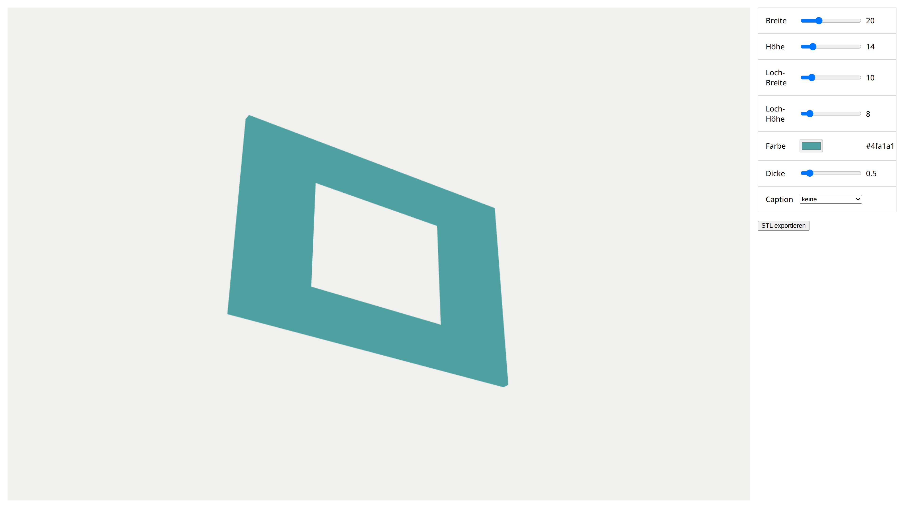

# flatbutton

Flatbutton is my take on a configurator to create tactile buttons meant to
be placed as a guide on touch devices such as ovens and other appliances.
Right now, it's built around creating and exporting a single button at a time.

To run and view this project, a working installation of Node/npm is needed.



## Getting started

```bash
# Install dependencies
npm install

# Start the dev server, then open the printed localhost URL in your browser
npm run dev
```
